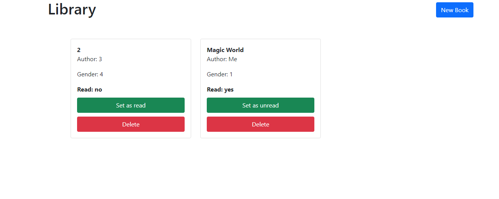

# Books management - Frontend

> An easy way to manage a local library in localstorage



## Built With

- HTML
- CSS
- Bootstrap
- JavaScript

## Live Demo

[Live Demo Link](https://elberthcorniell.github.io/library-js/)

## Getting Started


To get a local copy up and running follow these simple example steps.

### Prerequisites

- Live Server plugin for Visual Studio Code 

### Setup

1- Clone the repository
```
    git clone https://github.com/elberthcorniell/library-js.git
```

2- Open the folder on VS Code. 
```
    cd library-js
    code .
```

3- Right click the index.html file and click on "Open With Live Server"

4- Everything should be running by now. 


## Author

👤 **Elbert Corniell**

- GitHub: [@elberthcorniell](https://github.com/elberthcorniell)
- Twitter: [@elberthcorniell](https://twitter.com/elberthcorniell)
- LinkedIn: [LinkedIn](https://www.linkedin.com/in/elbert-corniell-989183159/)

## Acknowledgments

- [Microverse](https://www.microverse.org/)

## 🤝 Contributing

Contributions, issues, and feature requests are welcome!

Feel free to check the [issues page](https://github.com/elberthcorniell/library-js/issues).

## Show your support

Give a ⭐️ if you like this project!


## 📝 License

This project is [MIT](./LICENSE) licensed.
